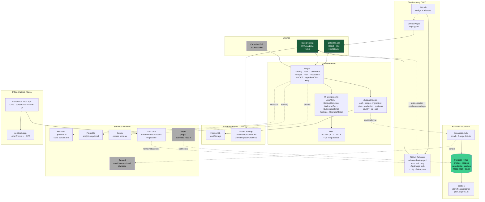

# Arquitectura GelatoLab

Diagrama de arquitectura de la aplicación, sus dependencias y servicios externos.

## Conceptos clave

- **Local-first**: los datos viven en IndexedDB del cliente. La nube (Supabase) es opcional, solo para sync entre dispositivos.
- **Free vs Pro**: gating en `lib/entitlement.js`. La bandera `profiles.plan` en Supabase decide qué features se desbloquean.
- **Auto-updater desktop**: la app valida cada release con minisign (clave keyless), los `.sig` se generan en `release-desktop.yml`.
- **Componentes en gris**: aún no implementados pero forman parte del plan (Mobile, Stripe, Resend, Authenticode).
